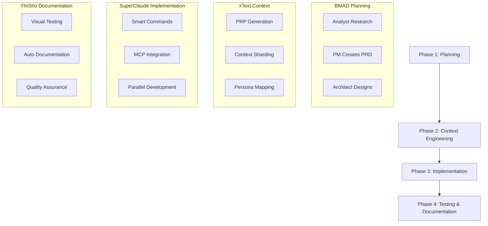

# SupaBMADFloSho Architecture

## 🚀 The Ultimate AI Development Framework

SupaBMADFloSho combines three powerful frameworks into one cohesive system:
- **BMAD-METHOD**: Agentic planning and structured development workflows
- **xText-PRP**: Context engineering and requirements prompts
- **SuperClaude**: Enhanced commands and personas
- **FloSho**: Visual testing and automatic documentation

## 🎯 Core Principles

### 1. Three-Phase Development Flow


## 🏗️ Unified Command System

### Command Namespaces
```
/bmad:*     - Planning and workflow commands
/xt:*       - Context engineering commands  
/sc:*       - SuperClaude implementation commands
/fs:*       - FloSho testing commands
/supa:*     - SupaBMADFloSho meta commands
```

### Key Command Integrations
1. **Planning to Context**: `/bmad:plan` → `/xt:prp`
2. **Context to Implementation**: `/xt:init` → `/sc:implement`
3. **Implementation to Testing**: `/sc:build` → `/fs:flow`
4. **Testing to Documentation**: `/fs:test` → `/supa:document`

## 🧠 Agent Hierarchy

### Master Agents
1. **BMAD Orchestrator** - Overall workflow management
2. **xText Context Master** - Requirements and context control
3. **SuperClaude Commander** - Implementation coordination
4. **FloSho Director** - Testing and documentation lead

### Specialist Agents
```yaml
Planning Layer (BMAD):
  - Analyst: Market research and competitive analysis
  - PM: Product requirements and roadmap
  - Architect: Technical design and system architecture
  - PO: Epic and story management

Context Layer (xText):
  - PRP Engineer: Requirements prompt generation
  - Context Sharding: Breaking down large documents
  - Persona Mapper: Assigning work to right personas

Implementation Layer (SuperClaude):
  - 11 Smart Personas: Frontend, Backend, Database, etc.
  - MCP Connectors: External tool integration
  - Parallel Workers: Concurrent development

Quality Layer (FloSho):
  - Visual Tester: UI/UX validation
  - Doc Generator: Automatic documentation
  - QA Reviewer: Code quality checks
```

## 🔄 Unified Workflow

### 1. Project Initialization
```bash
/supa:init "Your project idea"
```
This triggers:
- BMAD Analyst for market research
- xText PRP generation
- SuperClaude persona assignment
- FloSho test framework setup

### 2. Planning Phase
```bash
/bmad:plan → /bmad:prd → /bmad:architect
```
Produces:
- Comprehensive PRD
- Technical Architecture
- Epic breakdown
- Resource allocation

### 3. Context Engineering
```bash
/xt:context → /xt:shard → /xt:distribute
```
Creates:
- Sharded requirements
- Context-aware stories
- Persona assignments
- Implementation guidelines

### 4. Development Phase
```bash
/sc:implement → /sc:parallel → /sc:integrate
```
Executes:
- Parallel development streams
- Smart persona execution
- MCP tool integration
- Continuous integration

### 5. Testing & Documentation
```bash
/fs:test → /fs:document → /fs:publish
```
Generates:
- Visual test results
- Auto-generated docs
- Quality reports
- Deployment guides

## 📦 Directory Structure
```
SupaBMADFloSho/
├── .claude/                    # Claude configuration
│   ├── SUPA_RULES.md          # Unified rules
│   └── commands/              # All command definitions
├── planning/                  # BMAD planning layer
│   ├── agents/               # Planning agents
│   ├── workflows/            # Development workflows
│   └── templates/            # Document templates
├── contexts/                 # xText context layer
│   ├── engineering/          # Context engineering
│   ├── prp/                 # PRP templates
│   └── sharding/            # Document sharding
├── implementation/          # SuperClaude layer
│   ├── personas/            # Smart personas
│   ├── commands/            # Implementation commands
│   └── mcp/                 # MCP integrations
├── testing/                 # FloSho layer
│   ├── visual/              # Visual testing
│   ├── flows/               # Test flows
│   └── documentation/       # Auto-generated docs
└── orchestration/           # SupaBMADFloSho meta layer
    ├── unified-workflow/    # Integrated workflows
    ├── conflict-resolution/ # Handle overlaps
    └── optimization/        # Performance tuning
```

## ✨ Key Innovations

### 1. Context-Aware Planning
BMAD's planning agents now use xText PRPs as their foundation, ensuring requirements are AI-optimized from the start.

### 2. Persona-Driven Development
SuperClaude personas read BMAD stories with full xText context, implementing with complete understanding.

### 3. Automatic Test Generation
FloSho reads the PRP and automatically generates test scenarios matching requirements.

### 4. Zero-Redundancy Architecture
- One source of truth (PRP)
- No duplicate commands
- Shared context across all agents
- Unified workflow management

### 5. Intelligent Routing
SupaBMADFloSho automatically routes tasks to the right framework:
- Complex planning → BMAD agents
- Context setup → xText engineering
- Implementation → SuperClaude personas
- Testing/Docs → FloSho automation

## 🎯 Benefits Over Individual Frameworks

1. **Complete Coverage**: From market research to deployed documentation
2. **No Context Loss**: Information flows seamlessly between phases
3. **Parallel Execution**: Multiple agents working simultaneously
4. **Quality Built-In**: Testing and documentation automatic
5. **Extensible**: Easy to add new agents, personas, or workflows
6. **Framework Agnostic**: Works with any AI (Claude, GPT, Gemini)

## 🚀 Getting Started

```bash
# Initialize a new project
/supa:init "Build a SaaS platform for team collaboration"

# The system will:
# 1. Run BMAD Analyst for market research
# 2. Generate comprehensive PRD with PM
# 3. Create architecture with Architect
# 4. Engineer context with xText
# 5. Assign to SuperClaude personas
# 6. Set up FloSho testing
# 7. Begin coordinated development

# You'll get:
# - Complete project structure
# - All planning documents
# - Context-aware implementation
# - Automatic testing setup
# - Real-time documentation
```

## 🔮 The SupaBMADFloSho Advantage

This isn't just a merger - it's an evolution. Each framework's strengths amplify the others:

- BMAD's structured planning feeds xText's context engineering
- xText's PRPs guide SuperClaude's implementation
- SuperClaude's output drives FloSho's testing
- FloSho's documentation validates BMAD's requirements

The result? A self-reinforcing system that gets smarter with each project.
