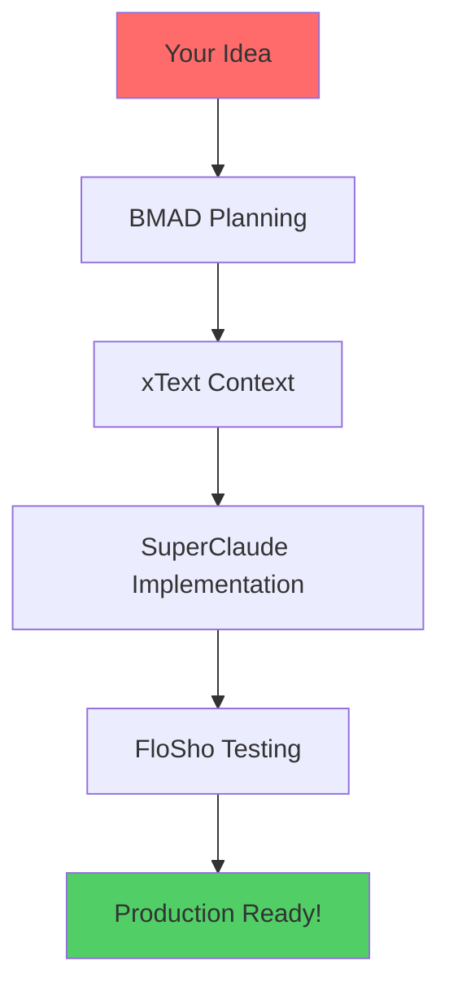

# 🚀 Floetry

> The Ultimate AI Development Framework - Where Planning Meets Context Meets Implementation Meets Testing

[](https://github.com/a2thalex/SupaBMADFloSho)
[](ARCHITECTURE.md)
[](LICENSE)

## 🎯 What is Floetry?

Floetry is the intelligent merger of four powerful AI development frameworks:

- **BMAD-METHOD**: Agentic planning and structured workflows
- **xText-PRP**: Context engineering and AI-optimized requirements
- **SuperClaude**: Enhanced commands and smart personas
- **FloSho**: Visual testing and automatic documentation

But it's not just a merger - it's an evolution. Each framework's strengths amplify the others, creating a development experience that's 10x faster and more reliable than any individual system.

## 🌟 Why Floetry?

### The Problem with Individual Frameworks

- **BMAD alone**: Great planning but limited context preservation
- **xText alone**: Excellent context but no structured workflow
- **SuperClaude alone**: Powerful commands but no planning phase
- **FloSho alone**: Great testing but needs manual setup

### The Floetry Solution



**One workflow, four frameworks, zero redundancy.**

## ⚡ Quick Start

```bash
# Install SupaBMADFloSho
npx supabmadflosho install

# Initialize your first project
/supa:init "Build a SaaS platform for team collaboration"

# Watch the magic happen!
```

## 🎮 Unified Commands

### Master Commands
- `/supa:init [idea]` - Initialize complete project with all frameworks
- `/supa:plan [mode]` - Run unified planning workflow
- `/supa:implement [story]` - Context-aware implementation
- `/supa:test [scope]` - Automated testing and documentation
- `/supa:optimize` - Optimize workflow and resolve conflicts

### Framework Commands (Still Available)
- `/bmad:*` - BMAD planning commands
- `/xt:*` - xText context commands
- `/sc:*` - SuperClaude implementation commands
- `/fs:*` - FloSho testing commands

## 🧠 How It Works

### 1. Intelligent Planning (BMAD + xText)
```yaml
Input: "Build a task management app"
Output:
  - Market analysis (BMAD Analyst)
  - Comprehensive PRD (BMAD PM) 
  - Technical architecture (BMAD Architect)
  - AI-optimized PRP (xText)
  - Sharded requirements (xText)
```

### 2. Context-Aware Implementation (SuperClaude + PRP)
```yaml
Personas read PRP and implement with full context:
  - Frontend Dev: Builds UI matching PRD specs
  - Backend Dev: Creates APIs per architecture
  - Database Expert: Designs schema from requirements
  - DevOps: Sets up infrastructure per specs
All working in parallel with shared context!
```

### 3. Automatic Quality (FloSho + BMAD QA)
```yaml
Tests generated from PRP:
  - Visual regression tests
  - API endpoint validation
  - Integration test suites
  - Performance benchmarks
Plus automatic documentation!
```

## 📊 Performance Comparison

| Task | Traditional | Individual Framework | SupaBMADFloSho |
|------|------------|---------------------|----------------|
| Planning | 1 week | 2-3 days | 4-8 hours |
| Implementation | 2-3 weeks | 1 week | 2-3 days |
| Testing | 1 week | 3-4 days | Automatic |
| Documentation | 3-4 days | 2 days | Automatic |
| **Total** | **4-5 weeks** | **2 weeks** | **3-4 days** |

## 🔥 Key Features

### 🎯 Zero Redundancy
- One source of truth (PRP)
- No duplicate commands
- Shared context across all agents
- Unified workflow management

### 🚀 Parallel Execution  
- Multiple agents work simultaneously
- Personas develop different features in parallel
- Tests run during development
- Documentation generates automatically

### 🧪 Quality Built-In
- Requirements traced to implementation
- Tests match user stories
- Documentation stays current
- Continuous validation

### 🔌 Extensible Architecture
- Add new agents easily
- Create custom personas
- Define new workflows
- Integrate additional tools

## 📁 Project Structure

```
SupaBMADFloSho/
├── planning/           # BMAD planning layer
├── contexts/          # xText context engineering
├── implementation/    # SuperClaude execution
├── testing/           # FloSho validation
├── orchestration/     # Unified control
└── .claude/           # Configuration
```

## 🚀 Getting Started

### 1. Install
```bash
git clone https://github.com/a2thalex/floetry.git
cd floetry
python setup/install.py
```

### 2. Configure
```bash
# Edit .claude/supa-config.json
# Set your preferences and enabled features
```

### 3. Initialize Project
```bash
/supa:init "Your amazing idea"
```

### 4. Follow the Flow
The system will guide you through:
1. Planning with BMAD agents
2. Context setup with xText
3. Implementation with SuperClaude
4. Testing with FloSho

## 📚 Documentation

- [Architecture Overview](ARCHITECTURE.md)
- [Unified Rules](.claude/SUPA_RULES.md)
- [Command Reference](docs/COMMANDS.md)
- [Example Projects](docs/examples/)
- [Integration Guide](docs/INTEGRATION.md)

## 🤝 Contributing

We welcome contributions! See [CONTRIBUTING.md](CONTRIBUTING.md) for guidelines.

### Areas for Contribution
- New agent types
- Additional personas
- Workflow templates
- Integration adapters
- Documentation improvements

## 🌟 Success Stories

> "We built our entire SaaS platform in 3 days instead of 3 months!" - StartupCTO

> "The automatic documentation alone saved us weeks of work." - EnterpriseTeam

> "Finally, AI development that actually understands context!" - SoloFounder

## 🛠️ Troubleshooting

### Common Issues

**Q: Commands not working?**
A: Ensure all frameworks are installed: `python setup/install.py --verify`

**Q: Conflicts between frameworks?**
A: Run `/supa:optimize` to resolve conflicts automatically

**Q: How to update?**
A: `git pull && python setup/install.py --update`

## 📈 Roadmap

- [ ] Web UI for visual workflow management
- [ ] Cloud sync for team collaboration
- [ ] AI model agnostic (GPT, Gemini, etc.)
- [ ] Plugin marketplace
- [ ] Enterprise features

## 📜 License

MIT License - see [LICENSE](LICENSE) for details.

## 🙏 Acknowledgments

Built on the shoulders of giants:
- BMAD-METHOD by [@bmadcode](https://github.com/bmadcode)
- xText-PRP framework
- SuperClaude enhancements
- FloSho testing system

---

<p align="center">
  <b>Floetry</b> - Where AI Development Dreams Come True 🚀
  <br>
  <i>One System, Infinite Possibilities</i>
</p>
