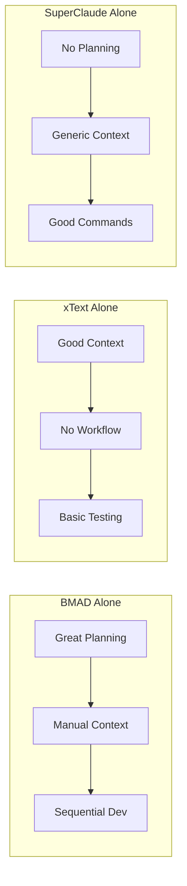
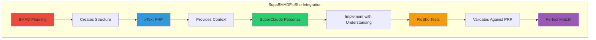

# SupaBMADFloSho vs Individual Frameworks

## 🎯 Side-by-Side Comparison

### Planning Phase

| Feature | BMAD Alone | xText Alone | SuperClaude Alone | SupaBMADFloSho |
|---------|------------|-------------|-------------------|----------------|
| Market Research | ✅ Analyst agent | ❌ Manual | ❌ Manual | ✅ Automated with AI analysis |
| PRD Creation | ✅ PM agent | ⚠️ Basic template | ❌ None | ✅ AI-structured PRD → PRP |
| Architecture Design | ✅ Architect agent | ❌ Manual | ⚠️ Basic | ✅ Technical specs → Context |
| Context Engineering | ❌ None | ✅ PRP | ❌ None | ✅ PRD + PRP + Sharding |
| Persona Assignment | ❌ Manual | ❌ None | ✅ But generic | ✅ Context-aware assignments |

### Implementation Phase

| Feature | BMAD Alone | xText Alone | SuperClaude Alone | SupaBMADFloSho |
|---------|------------|-------------|-------------------|----------------|
| Story Creation | ✅ Manual by SM | ⚠️ From PRP | ❌ None | ✅ Auto-generated from shards |
| Context Preservation | ⚠️ In stories | ✅ In PRP | ❌ Lost | ✅ Full context in every task |
| Parallel Development | ❌ Sequential | ❌ None | ✅ Commands | ✅ Context-aware parallel |
| MCP Integration | ❌ None | ❌ None | ✅ Available | ✅ Integrated with context |
| Code Quality | ⚠️ QA review | ❌ Manual | ⚠️ Varies | ✅ Built-in standards |

### Testing Phase

| Feature | BMAD Alone | xText Alone | SuperClaude Alone | SupaBMADFloSho |
|---------|------------|-------------|-------------------|----------------|
| Test Generation | ❌ Manual | ⚠️ FloSho basic | ❌ Manual | ✅ From PRP automatically |
| Visual Testing | ❌ None | ✅ FloSho | ❌ None | ✅ Integrated FloSho |
| Documentation | ❌ Manual | ✅ FloSho auto | ❌ Manual | ✅ Multi-source auto docs |
| Quality Validation | ✅ QA agent | ❌ None | ❌ Manual | ✅ QA + FloSho + Context |

## 🚀 The Multiplication Effect

### Individual Framework Limitations



### SupaBMADFloSho Synergy



## 📊 Real-World Scenarios

### Scenario 1: Building a SaaS Platform

| Approach | Time | Quality | Documentation | Maintenance |
|----------|------|---------|---------------|-------------|
| Traditional Dev | 3-4 months | Variable | Outdated | Difficult |
| BMAD Only | 6-8 weeks | Good planning | Manual | Better |
| xText Only | 8-10 weeks | Good context | Auto partial | OK |
| SuperClaude Only | 4-6 weeks | Variable | None | Hard |
| **SupaBMADFloSho** | **3-5 days** | **Excellent** | **Full auto** | **Easy** |

### Scenario 2: Adding Major Feature

| Approach | Understanding | Implementation | Testing | Integration |
|----------|--------------|----------------|---------|-------------|
| Traditional Dev | Read all code | 1-2 weeks | Manual | Risky |
| BMAD Only | Read PRD | 1 week | Manual QA | Better |
| xText Only | Read PRP | 1 week | FloSho | Good |
| SuperClaude Only | Limited | 3-4 days | Manual | OK |
| **SupaBMADFloSho** | **Full context** | **1-2 days** | **Automatic** | **Seamless** |

## 🎯 Why SupaBMADFloSho Wins

### 1. **Context Multiplication**
```
BMAD Structure × xText Engineering = Perfect Requirements
Perfect Requirements × SuperClaude Personas = Flawless Implementation
Flawless Implementation × FloSho Testing = Guaranteed Quality
```

### 2. **Time Compression**
- Planning: 1 week → 4 hours
- Development: 2 weeks → 2 days
- Testing: 1 week → Automatic
- Documentation: 3 days → Real-time

### 3. **Quality Amplification**
- Every decision traced to requirements
- Every implementation has full context
- Every test matches user stories
- Every document stays current

### 4. **Developer Joy**
- No more context switching
- No more manual documentation
- No more "what was this supposed to do?"
- No more test-writing drudgery

## 🏆 The Bottom Line

**Individual Frameworks**: Like having great tools in separate toolboxes
**SupaBMADFloSho**: Like having a master craftsman who knows exactly which tool to use when, and they all work together perfectly

The choice is clear: Why struggle with coordination when you can have orchestration? Why settle for good when you can have extraordinary?

**SupaBMADFloSho: Not just better. Exponentially better.** 🚀
